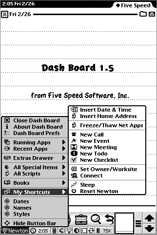
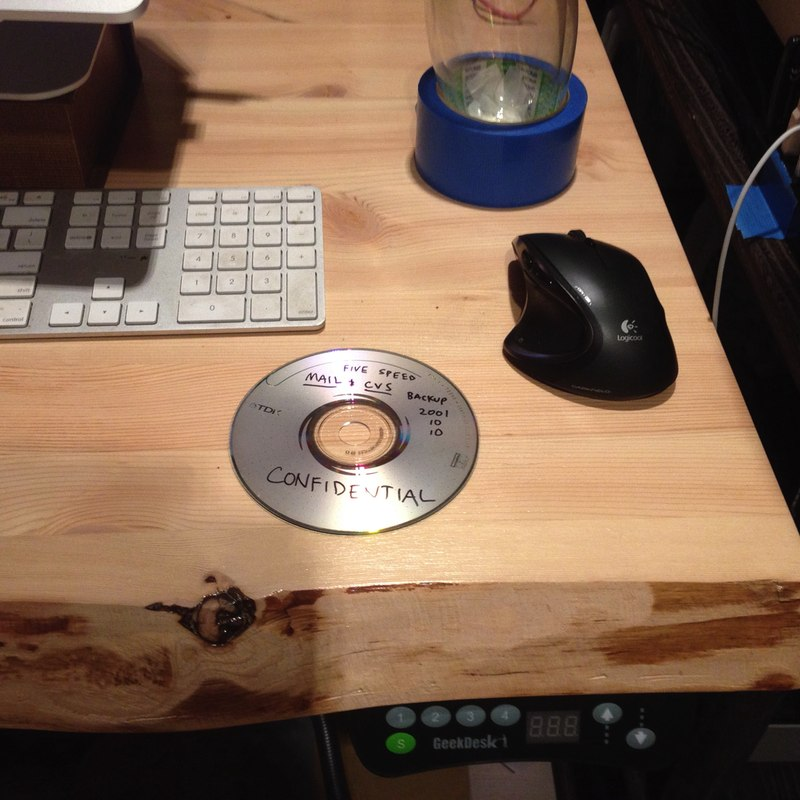
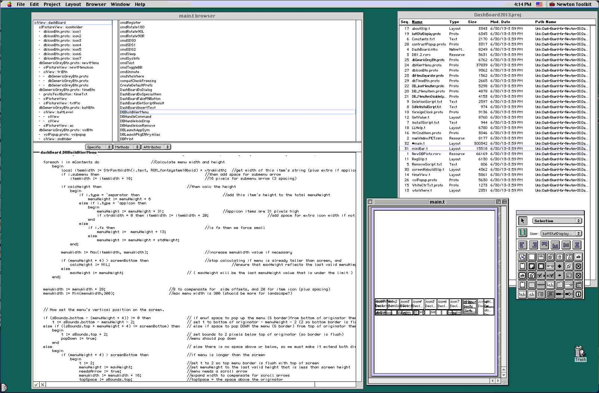
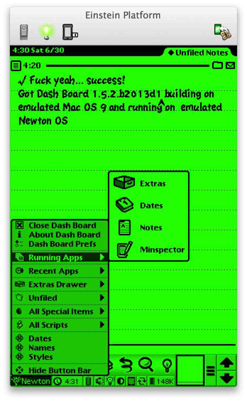
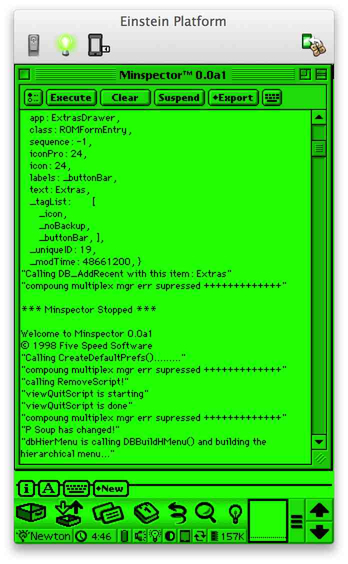
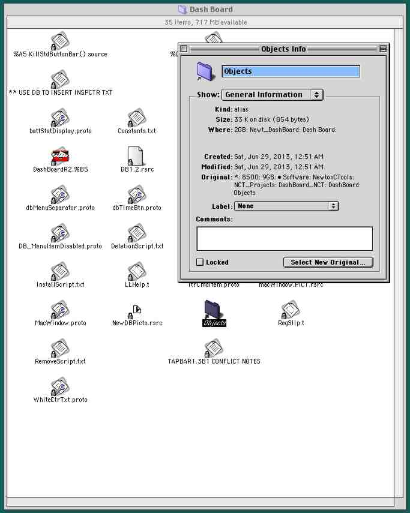
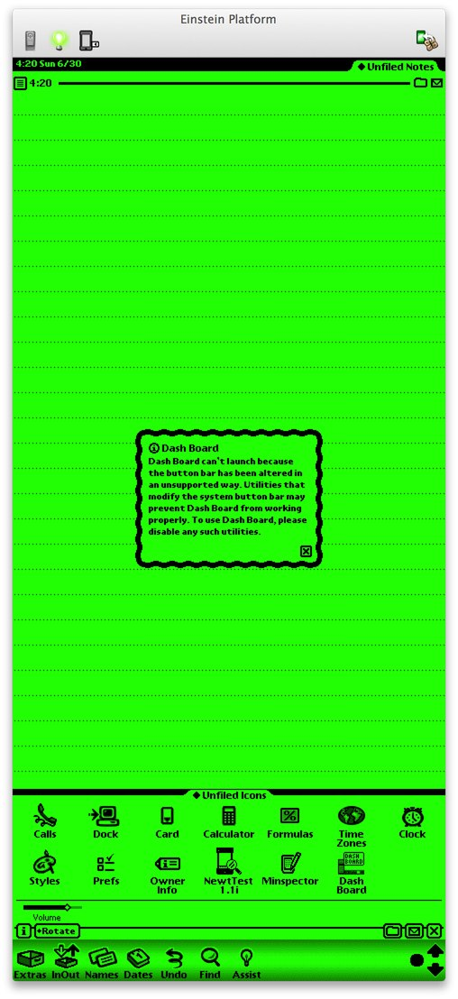
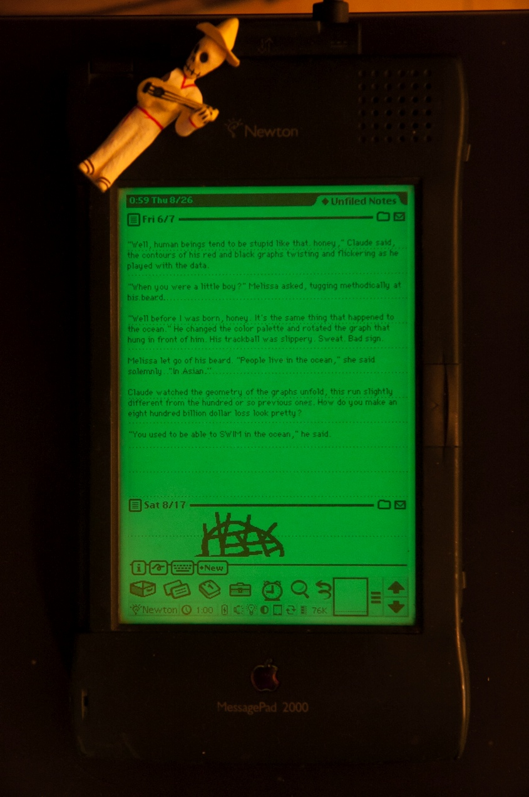
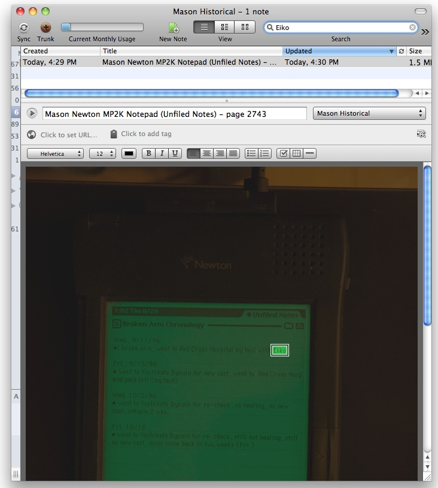
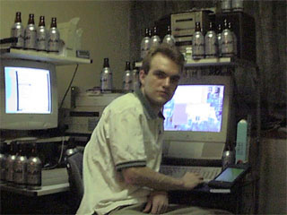

# Dash Board 2013

a Comic Tragedy in Nine Acts, by Mason Mark (principal author of Dash Board)

*June 30, 2013 — Tokyo, Japan*

## TL;DR

This is the (very belated and procrastinated) open source release of Dash Board for Newton OS.

Dash Board was a popular interface enhancement for Newton OS 2.1 in the late 1990s. 

To run this software on your Newton or (more likely) your [Newton Emulator](http://code.google.com/p/einstein/), you need only install the packages *DashBoard2013.proj.pkg* and *DashBoardPrefs.proj.pkg*, which can be found alongside their respective project files in this archive.

To hack on and build this software, however, you will very probably need to read at least [the build instructions below](#howtobuild), because it is a fairly convoluted process, for historical reasons, and is not obvious even for people who are familiar with compiling software from the source.

Dash Board requires Newton OS 2.1.

## The Long-form Version

June 30, 2013 marks the 15th anniversary of the release of [Dash Board](http://www.fivespeedsoftware.com/dashboard/) 1.0 for Newton OS.

<center></center>

I've been meaning to make Dash Board free for many years now, and this project, "Dash Board 2013" is the long-procrastinated effort to do that. However, for reasons described below, it wasn't just a simple matter of uploading the source code to GitHub and posting a note to the NewtonTalk mailing list.

### Act I — Dude, where's my source?

The first question I had to ask myself was: hmm, yeah, where the fuck *is* the Dash Board source code?

The answer was -- and is -- that nobody knows. The best guess is that the only remaining copy of the canonical 1.5.1 release archive is on a server backup CDROM in a spindle in a ziplock bag in a box on a pallet in the basement of the building that housed Five Speed's old office in Málaga, Spain. (That office closed in 2004.)

So I don't have *the* source code. But I did find *some* source code on an old, scratched, wine-spattered DVD of miscellaneous backups from my personal archives from 2001, which amazingly could still be read.

<center></center>

(I wiped off the wine spatters with a baby wipe; should have taken the photo first....)

However, just because the data could be read, that turned out to not mean that it could be used easily. The DVD didn't contain a back up of the code itself, it contained a backup of the CVS source control server data which *contained* the code. The source code was in there, but it was in an obscure (and frankly *fucktarded to the bone*) data format from 1999. 

### Act II — Cockamamie Vagarious Suckage (CVS)

Throughout the development of Dash Board in the 1990s, I didn't use any version control system. I just took manual snapshots of the whole project every couple hours.

That sounds completely insane to me now, but gradually made more and more sense as I tried to recover this old Newton project, and remembered how horribly bad the version control story for Mac OS back then actually was.

Like a lot of Mac programs in those days, NTK **required** the resource forks of its files to be intact. This idea never worked out, really. Virtually no software outside of the Mac's narrow island kingdom ever supported this (although I personally was a fan of the use of the resource fork to *augment* files with non-essential but helpful data, such as the selected range and text zoom settings of an otherwise standard text file (well, I guess I mean *plain* text file, not *standard*, since most people were still mired in the barbaric morass of text-encodings-other-than-UTF-8 in the 1990s)).

Anyway, CVS didn't originally support resource forks, so people came up with this kludgey idea to have "wrappers" that would encode files on their way into CVS and decode them on their way out. As I recall, this was a contentious issue -- mostly because it's a terrible idea that could never work well -- and the feature was later removed from CVS entirely by its maintainers. Apple would halfheartedly maintain their own custom resource-fork-supporting fork of CVS for a while, but by the turn of the millennium even Apple was starting to realize that the way they had used dual file forks was actually one of the worst decisions in the history of computers (and in fact Mac OS X would not fully support resource forks well for many years after its release).

I had to dredge up these historical facts from my memories because the Dash Board code, inevitably, had been processed with cvswrappers to allow it to be checked into CVS. 

Naturally, when I tried to set up a CVS server on my current OS X system (10.8) so I could check out the files, it totally didn't work. The cvs binary that comes with Xcode 4 told me:

    cvs [checkout aborted]: -t/-f wrappers not supported by this version of CVS

But I recalled that older versions of OS X *had* supported CVS+cvswrappers, so with a theatric sigh, I logged into one of my VMWare VMs that still runs 10.6, and tried setting it up there. Still didn't work, but this time it at least gave me a hint:

    cvs [checkout aborted]: -t/-f wrappers not supported by this version of CVS
    A legacy version of cvs with -t/-f wrapper support is available as: /usr/bin/ocvs.

Oh cool, it looked like they preserved their legacy version of CVS just for cases like mine. But, whoops:

    [support@tokyo cvs-rescue-attempt]$ /usr/bin/ocvs
    -bash: /usr/bin/ocvs: No such file or directory
    [support@tokyo cvs-rescue-attempt]$ 

*Zounds, thwarted again! And just when I was so close*, you think to yourself. To begin the tedious process of trying to boot progressively older versions of Mac OS X until you find one that will work with cvswrappers and mimic your original CVS server, turn to Act III. To decide Miller Time starts *right now*, and give up this quest, close this window.

### Act III — Mac OS X.III, That Is

Skipping the boring details of trying to find that old PPC PowerBook in the storage boxes under the stairs, and booting older and older versions of Mac OS X, once I had finally booted to Mac OS X 10.3 ("Panther"), and installed a fresh copy of Xcode 1.5 from the Apple developer website, CVS wrappers appeared to work.

(I basically followed the instructions on [this web page](http://vorg.ca/440-How-to-set-up-a-cvs-server-on-mac-os-x-10.3-panther) to get the CVS server running in insecure local network mode; however, the crypted password steps did not work until I changed my complex password to "cvs".)

Appearances can be deceiving, though; while checking out the project via the OS X 10.3 command line completed without error, the files were not correct. The filenames were all mangled, for one thing. (Oh yeah, text encodings.) Furthermore, the resource forks didn't come out right.

Still, at least it seemed like the CVS *server* part of things was working; the problem looked like it was with the client. Which made a certain amount of sense; back in the day I was using Netscape Corporation's CVS client, MacCVS, running on Mac OS 8... and happily, there was still a [website for it](http://www.maccvs.org) that was working.

Thus, it seemed that if I could get Mac OS 8 booting, then I would finally maybe be actually able to extract the Dash Board source code and look at it!

### Act IV — Shaving Years off the OS

Getting the classic Mac OS booted turned out to be way, way easier than I expected -- mainly because I happened to have a working ROM image from an old PPC Mac and the Mac OS 9 retail CD image on hand, already. (However, I am pretty sure both of those are easily found in the interweb tubes.)

Just download [SheepShaver](http://sheepshaver.cebix.net), unpack it, launch it, set up its prefs, create a disk of a couple GB or so, lock your Mac OS 9 .iso image in the Finder on the OS X so it mounts read-only (otherwise the Mac OS 9 installer will throw a tantrum), add the .iso as a disk, and -- **boom!** -- you're on your way:

<center></center>

Almost immediately after booting my newly minted Mac OS 9 system, I found myself repeatedly accidentally invoking Sherlock 2 via some keyboard shortcut.

<center></center>

Wow! I think it's my old buddy [Brushed Metal](http://daringfireball.net/2006/01/brushed_metal) although apparently still in his pre-pubescent stage.

Anyway, here's one Sherlock 2 protip: if you've shared a big folder from OS X with your SheepShaver instance, it might be a good idea to disable indexing to prevent ol' Mac OS 9 from trying to index what it sees as an enormous Mac hard disk full of strange alien files from the future... 

<center></center>

Notice that there is no actual "Don't index anything" option. That still cracks me up...

Anyway fuck a bunch of Sherlock 2, what about MacCVS? 

Yeah, that launched fine too, and seemed to do whatever magic it needed to do to check out those files that it had last checked in 15 years previously:

<center></center>

So the only question left to ask was... would it build?

### Act V — NTK

Yep.

<center></center>

### Act VI — Einstein

This was awesome, but how did I know that the build really worked? Or perhaps more accurately: how did I find out that the build *didn't work*, at first?

I have a mostly working Newton MP2000 still, but I don't have the necessary gear to establish a serial connection. And I didn't have time to order it online -- if I didn't get Dash Board open sourced this weekend, it might well be another ten years before I finished the job.

I knew Paul Guyot and Matthias Melcher had done a fabulous job with [Einstein, the Newton emulator](http://code.google.com/p/einstein/), but I didn't quite realize how fabulous. The thing is fuckin' awesome.

<center></center>

It didn't really look like that at first, though; when I first tried to use the Newton menu it threw a bunch of error -48807 alerts. At first I was concerned, because a -48807 error is a kinda generic 'undefined variable' interpreter error. How would I find that without being able to connect my Newton to the debugger with a serial cable?

The answer, of course, was [Minspector](http://www.fivespeedsoftware.com/minspector/)! (w00t w00t)

I wrote Minspector and released it on June 22, 2008 (5,487 days ago as of this writing!) precisely because I hated having to physically wire up my Newton to a Mac with a cable just to see my debug print statements.

I installed it on Einstein -- *et voila!* 

<center></center>

OK! So I could see Dash Board was logging "dbHierMenu is calling DBBuildHMenu() and building the hierarchical menu..."

Back in Newton Toolkit on the Mac OS 9 side of things, I searched for that print statement and found the code in question:

    func (sBounds, mContents, mOriginator)
    begin
    	if debugOn then
    	begin
    		print("dbHierMenu is calling DBBuildHMenu() and building the hierarchical menu...");
    		local sTicks := Ticks();
    	end;

    	local sOne := call DashBoard.Skewzoid with ();  				
          //Skewzoid checks if we are over the limit, returns 
            // 0 (nice demo), 
            // 1 (7 days-14 days), 
            // or 2 (14-18 days), 3 (18+)

    	if sOne > 2 then
    		mContents := DB_Skew; // this shows annoying demo expired message in menu


Hmm, WTF is DashBoard.Skewzoid? I did't remember anymore, but the syntax was telling. 

    call DashBoard.Skewzoid with ();

I realized that function, Skewzoid(), was defined in Dash Board's C++ module. On the Newton, it was so beautifully easy to decompile a NewtonScript app back to fairly readable source code. In order to obfuscate the extremely sophisticated machinations of my serial number algorithm (it converted the user's name to a number, and then multiplied that number by 43867, and divided the result by 187 (*LOL*)), I compiled it with the Newton C Tools, which produced a slightly more opaque binary format.

And here, I found the first real problem of the Dash Board resurrection. The C++ module was **missing**. What was checked into CVS, somehow, was a fucking *Mac alias file*. Here it is:

<center></center>

I looked at the alias's files **Original** path:

    8500:9GB:• Software:NewtonCTools:NCT_Projects:Dashboard_NCT:DashBoard:Objects
    
*Damn it!* I shouted. At this point, it was starting to look like this Saturday project was gonna carry over in Sunday. (It did.)

That path points to my old Power Mac 8500. 

"9GB" was the name of my hard disk, just as 768GB is the name of the boot SSD of the notebook I am typing this on (and, as an aside, while I obviously must like this uncreative disk-naming scheme since I have been doing it for 15 years, it does make me really wish Apple would just stop fucking around and ship a notebook with a 1TB internal SSD... that would somehow be a lot less annoying to type). 

"• Software" was how I named my folders back in those days, just to make sure I had as many problems as possible when I wanted to bringing the data over to modern systems later, in the 21st century, e.g. right now doing this.

And the rest of the path points to a different source tree that the C tools used, separated from the source tree that the regular Newton Toolkit used. 

The C++ module never changed after it was built, and probably always existed on that machine, and since I was the only one who ever built Dash Board, nobody had ever noticed that the actual code wasn't checked into CVS, but just an alias to it.

So that code was **gone**.

Well, fuck it, having come this far, I wasn't going to let that stop me. All the C++ code did was implement features that I no longer wanted, since I was trying to open source it and remove it from sale. How hard could it be to just hack those features out? (Answer: I still don't know, since I only hacked out the first instance so far and am now rushing to finish this README so I can upload this shit to GitHub before bedtime. But, I don't think it will be hard at all.)

Here is the change I made:

    func (sBounds, mContents, mOriginator)
    begin
    	if debugOn then
    	begin
    		print("dbHierMenu is calling DBBuildHMenu() and building the hierarchical menu...");
    		local sTicks := Ticks();
    	end;

    	// 2013: deleted: local sOne := call DashBoard.Skewzoid with (); 
        // 2013: the line above uses the Long Lost Native C++ Code to check demo status... 
        // 2013: so... let's try just always returning 0 instead:
        local sOne := 0; 

    	if sOne > 2 then
  		  mContents := DB_Skew; // this shows annoying demo expired message in menu
          
And... **boom!** Dash Board worked. At least, worked enough to pop up the Newton menu. There are actually at least a couple more places where references to the C++ module have to be hacked out to avoid error messages and things not working.

So... *grrrreat*: after fifteen years, I suddenly have *new Dash Board bugs* to deal with.

On the other hand, though, this is not a show-stopper.


### Act VII — Git

Unlike the gut-wrenching, abominable revision control situation I survived in the 1990s, the situation today is pretty resoundingly awesome. After CVS we had Subversion, which was the same basic thing, with all the truly sucky edges polished off. It still basically sucked, but was serviceable.

But now we have Git. Some people say Git is Linus Torvalds' most significant contribution to humanity -- ahead of Linux. That's kind of an insane thing to say, but I get why people say it. Distributed version control is a big fuckin' deal, and Git emerged from that whole deal as the winner.

And then there's GitHub, too -- wow, bonus!

But, none of these awesome modern version control systems were going to support the archaic legacy resource forks needed by the Dash Board project.

So what to do? I was going to like separate the docs and the source out and put the NTK sources on an HFS disk image. But that would be completely inconvenient and incompatible with GitHub, too.

As it happened, Ethan, another Five Speed alumnus, strolled by on Google Hangouts right then. I asked him what I should do and he said, "[AppleDouble](http://en.wikipedia.org/wiki/AppleSingle_and_AppleDouble_formats), dude". Converting native Mac files to AppleDouble format strips the resource fork off, and encodes it in the data fork of a regular file named like "._filename file, making it compatible with virtually any filesystem on earth, as well as all tools like Git.

And, wow: the current shipping version of OS X (10.8) actually does have command line tools do convert to and from AppleDouble.

So, it would be annoying, but we could add a script to automate things later. I checked the project into Git, after converting it to AppleDouble. Initially, to convert the freshly checked out git repo back to legacy native Mac format, you have to run:

    /System/Library/CoreServices/FixupResourceForks .
    
Then, before making a commit back to the git repo, you have to convert back to AppleDouble, via:

    SplitForks .
    
Annoying? Sure is. But it's not like there is going to be a whole lot of hacking on Dash Board from here on out. This is for historical reference and to make using Einstein a little more pleasant. So: AppleDouble it is. √ DONE.


### Act VIII — GitHub

So I uploaded this whole project to GitHub. Oh yeah, a GitHub project should really have a README file.

Well, like Abe Lincoln once said to the Dalai Lama, *I would have written you a shorter letter but I didn't have time, broham*. Me, neither; I've just kinda had to bang this README out stream-of-consciousness style, while simultaneously keeping an eye on [one of my newer experimental projects](http://masonmark.com/version-2-dot-0a1) *and* drinking beer continuously.

And so: here we are.

### Act IX — What's next?

Well, let's be honest: not much. I don't really expect anybody to like, pick up the torch and carry my dead app from the 1990s rocketing into the future. And, considering that moving this source code from private CVS to public GitHub and writing this README took me more than *ten years* from when I decided to do it, I don't expect to author much in the way of improvements myself, either.

However, there are two things I would like to accomplish with Dash Board going forward.

First, I would like to fix all the bugs caused by the missing C++ code, which will have the side effect of removing all serial number requirements. That will happen, I think.

Second is a bona fide new feature. I would really, really like to fix the limitation of Dash Board not working with screen sizes that no Newton ever supported. I am not sure, though, if this will realistically happen. (I haven't even re-examined at the code involved yet.)

I very reluctantly decided not to make Dash Board intelligently resize itself to non-MP2x00 sizes. The API was there, and it was obviously the Right Thing to Do, but Dash Board only ran on the MP2x000 due to CPU constraints (technical term for "my lame inefficient code"), so I decided to cross that bridge when a new Newton shipped with a different form factor. Which, rather tragically, never happened.

In Einstein, you can set your Newton screen size to anything you want. Here is what Dash Board does if you make it big:

<center></center>

That's not exactly wrong; I am pleased that worked as intended since I never had a chance to actually test it. But it is clearly not ideal.

And I think supporting Einstein is important because I increasingly believe that emulation and virtualization are the best ways to deal with preserving the info of past generations.

I was a college student in Tokyo when I wrote Dash Board, and all my college notes are still stranded in my Newton. There was never a solution to getting them out of there, and into a format that subsequent tools could work with. 

There were a bunch of half-baked pieces of shit that didn't work, for any reasonable value of work, like Newton Connection Utilities. They could export sad little incorrect RTF fragments of my notes. With tons of bits wrong and tons of bits missing. But nothing that really solved the problem.

In fact, the best way I found to get them out was to photograph them, screen by screen, with a decent camera. 

<center></center>

(Oh, one of my early attempts at a novel. LOL, trackball.)

Then, I put the photos into Evernote (a horrific example of how even the very shittiest software you can conceive of, riddled with serious data-loss bugs and innumerable monstrous, gut-wrenchingly incorrect design decisions, can nevertheless compel you to use it if the feature set is right). They did OCR magic on all the notes, and now they are text searchable and persisted in the cloud:

<center></center>


But upon further reflection, the best way for me to look at my old college notes would be to somehow transfer all the data into a virtual Newton instance in Einstein, and look at them that way (but *cough* preferably at a larger size than 320x480...). Another fifteen years from now, when OS X has joined Newton OS in the Great Operating System Graveyard in the Sky, I could just emulate OS X emulating Newton OS and still see my notes in more or less their original form.

So I guess there is a third thing I hope to accomplish, although not directly related to Dash Board: I would like to get all my data from my hardware Newton devices into the virtual one running on Einstein.

I haven't yet looked around to see what tools are available and how much of a challenge that will be. But I plan to.


## On a personal note (not that this entire thing hasn't been a long and rambling personal note): Thanks

Finally, not really having anywhere better to express it, I want to say thank you, thank you, thank you to the thousands of people who bought Dash Board over the years. The success of Dash Board profoundly changed my life for the better.

It didn't make me rich, although to my college-student self it certainly seemed that it had  -- Dash Board grossed a little over $100,000.00, all told, including the $4,000.00 it sold in it's very first night, while I, exhausted by the effort to "ship 1.0" by June 30, slept in my tiny student apartment.

<center></center>

(That's basically the whole apartment, other than the bathroom.)

But writing Dash Board *did* make me a programmer. Until then, I'd been studying to be a journalist. I read the McKeehan/Rhodes book, [Programming for Newton](http://www.amazon.com/Programming-Newton-Macintosh-Julie-McKeehan/dp/012484832X) cover-to-cover like four times on the hour-long train commute to work, but it was a spare-time thing.

 I wasn't actually much of a programmer yet at all when I wrote Dash Board -- as a competent glance at the source code will reveal -- but that project and its success got me on the road to becoming one for real. 
 
 It also taught me that bad programmers can still make awesome software, ha ha ha. 
 
(I later learned that the inverse is also true.)

## Additional Notes, Musings, and Grievances

- I confirmed that the text "2013" doesn't exist anywhere in the project. So, I decided to annotate all changes to the source code made in 2013, as opposed to the 1990s, with "2013".

- NTK seems to have had a really weird bug, maybe. After converting the source tree to AppleDouble, I noticed really random-looking bits of old data--including private personal email and rather sketchy fragments of web pages I might have been browsing--embedded in the unused parts of the resource fork data. As if it wasn't actually zeroing out the disk areas it used, but just writing to parts of them and leaving whatever random data had been there before partly intact. (IIRC MS Word, some ancient version for System 7, also had that type of bug once.) Anyway, I didn't have time to investigate, so it could be something else. I did eyeball all the file, though, to make sure there wasn't anything *too* egregious in there. 

- It is Sunday night at 22:33 here, so fuck proofreading this document -- it is what it is. Good night.

### <a name="howtobuild"></a>How to Build
1. Clone the repo to your Mac OS X 10.8 system (no other Mac OS X has been tested yet)
2. In the terminal, cd into the top level folder of the repo
3. To hack on the source code, you must re-assemble all the files, which to be used with git have been split into separate data and resource forks (AppleDouble format). To do so, try this command:

        /System/Library/CoreServices/FixupResourceForks .

  and do not omit that trailing . or who knows what the hell might happen.
  
4. Use the SheepShaver emulator to boot Mac OS 9, and configure it to mount the OS X folder containing the repo as a disk. *Don't copy the repo to your SheepShaver VM's native storage, because it seems to lose the invisible git dirs when copying it back, thereby corrupting the repo.*
5. Hack, hack, hack, build.
6. Once you have completed a change you want to commit to the git repo, quit out of Newton Toolkit, and then go back to the OS X side of things. Again cd into the repo root dir, and run this command:

```
        SplitForks .
```

  This will again split the resource forks off of all files who have one, and store them as a separate invisible file (AppleDouble format). This convoluted dance is necessary because git absolutely doesn't work with resource forks and Newton Toolkit absolutely doesn't work without them.

7. Commit your changes, then treat yourself to a frosty beverage.


以上
