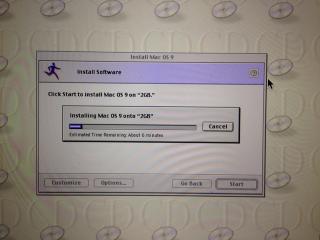
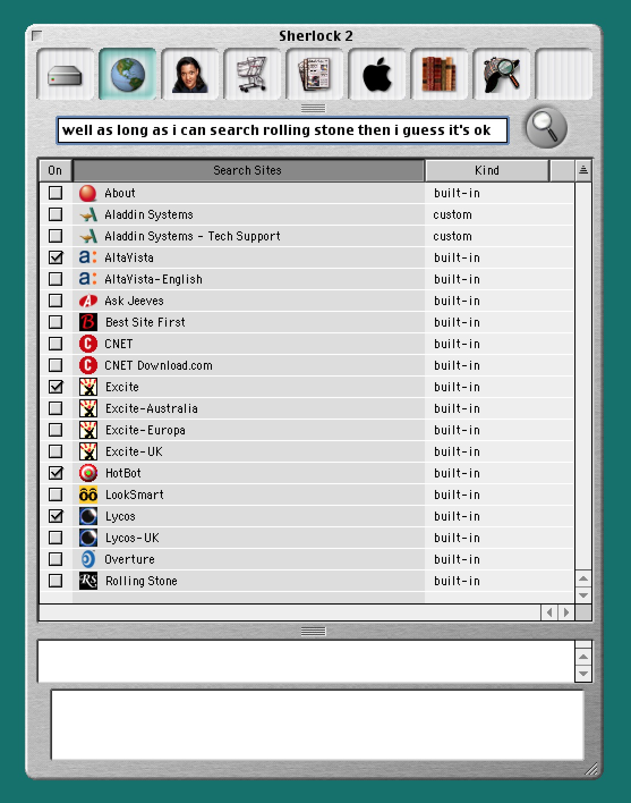
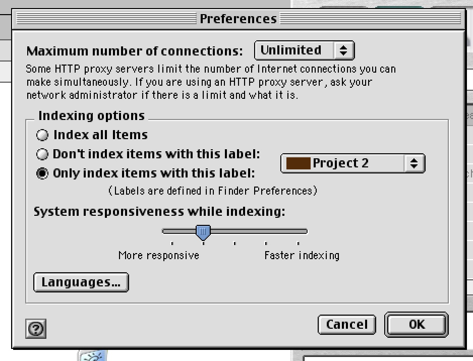
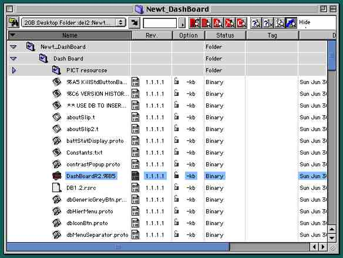

# Dash Board 2013

a Comic Tragedy in Nine Acts, by Mason Mark (principal author of Dash Board)

*June 30, 2013 — Tokyo, Japan*

## TL;DR

This is the (very belated and procrastinated) open source release of Dash Board for Newton OS.

Dash Board was a popular interface enhancement for Newton OS 2.1 in the late 1990s. 

To run this software on your Newton or (more likely) your [Newton Emulator](http://code.google.com/p/einstein/), you need only install the packages *DashBoard2013.proj.pkg* and *DashBoardPrefs.proj.pkg*, which can be found alongside their respective project files in this archive.

To hack on and build this software, however, you will very probably need to read at least [the build instructions below](#howtobuild), because it is a fairly convoluted process, for historical reasons, and is not obvious even for people who are familiar with compiling software from the source.

Dash Board requires Newton OS 2.1.

## The Whole Story

June 30, 2013 marks the 15th anniversary of the release of Dash Board 1.0 for Newton OS.

I've been meaning to make Dash Board free for many years now, and this project, "Dash Board 2013" is the long-procrastinated effort to do that. However, for reasons described below, it wasn't just a simple matter of uploading the source code to GitHub and posting a note to the NewtonTalk mailing list.

### Act I — Dude, where's my source?

The first question I had to ask myself was: hmm, yeah, where the fuck *is* the Dash Board source code?

The answer was -- and is -- that nobody knows. The best guess is that the only remaining copy of the canonical 1.5.1 release archive is on a server backup CDROM in a spindle in a ziplock bag in a box on a pallet in the basement of the building that housed Five Speed's old office in Málaga, Spain. (That office closed in 2004.)

So I don't have *the* source code. But I did find *some* source code on an old, scratched, wine-spattered DVD of miscellaneous backups from my personal archives from 2001, which amazingly could still be read.

However, just because the data could be read, that turned out to not mean that it could be used easily. The DVD didn't contain a back up of the code itself, it contained a backup of the CVS source control server data which *contained* the code. The source code was in there, but it was in an obscure (and frankly *fucktarded to the bone*) data format from 1999. 

### Act II — Cockamamie Vagarious Suckage (CVS)

Throughout the development of Dash Board in the 1990s, I didn't use any version control system. I just took manual snapshots of the whole project every couple hours.

That sounds completely insane to me now, but gradually made more and more sense as I tried to recover this old Newton project, and remembered how horribly bad the version control story for Mac OS back then actually was.

Like a lot of Mac programs in those days, NTK **required** the resource forks of its files to be intact. This idea never worked out, really. Virtually no software outside of the Mac's narrow island kingdom ever supported this (although I personally was a fan of the use of the resource fork to *augment* files with non-essential but helpful data, such as the selected range and text zoom settings of an otherwise standard text file (well, I guess I mean *plain* text file, not *standard*, since most people were still mired in the barbaric morass of text-encodings-other-than-UTF-8 in the 1990s)).

Anyway, CVS didn't originally support resource forks, so people came up with this kludgey idea to have "wrappers" that would encode files on their way into CVS and decode them on their way out. As I recall, this was a contentious issue -- mostly because it's a terrible idea that could never work well -- and the feature was later removed from CVS entirely by its maintainers. Apple would halfheartedly maintain their own custom resource-fork-supporting fork of CVS for a while, but by the turn of the millennium even Apple was starting to realize that the way they had used dual file forks was actually one of the worst decisions in the history of computers (and in fact Mac OS X would not fully support resource forks well for many years to come).

I had to dredge up these historical facts from my memories because the Dash Board code, naturally, was processed with cvswrappers to allow it to be checked into CVS. 

Naturally, when I tried to set up a CVS server on my current OS X system (10.8) so I could check out the files, it totally didn't work. The cvs binary that comes with Xcode 4 told me:

    cvs [checkout aborted]: -t/-f wrappers not supported by this version of CVS

But I recalled that older versions of OS X *had* supported CVS+cvswrappers, so 
With a theatric sigh, I logged into one of my VMWare VMs that still runs 10.6, and tried setting it up there. Still didn't work, but this time it at least gave me a hint:

    cvs [checkout aborted]: -t/-f wrappers not supported by this version of CVS
    A legacy version of cvs with -t/-f wrapper support is available as: /usr/bin/ocvs.

Oh cool, it looked like they preserved their legacy version of CVS just for cases like mine. But, whoops:

    [support@tokyo cvs-rescue-attempt]$ /usr/bin/ocvs
    -bash: /usr/bin/ocvs: No such file or directory
    [support@tokyo cvs-rescue-attempt]$ 

*Zounds, thwarted again! And just when I was so close*, you think to yourself. To begin the tedious process of trying to boot progressively older versions of Mac OS X until you find one that will work with cvswrappers and mimic your original CVS server, turn to Act III. To decide Miller Time starts *right now*, and give up this quest, close this window.

### Act III — Mac OS X.III, That Is

Skipping the boring details of trying to find that old PPC PowerBook in the storage boxes under the stairs, and booting older and older versions of Mac OS X, once I had finally booted to Mac OS X 10.3 ("Panther"), and installed a fresh copy of Xcode 1.5 from the Apple developer website, CVS wrappers appeared to work.

(I basically followed the instructions on [this web page](http://vorg.ca/440-How-to-set-up-a-cvs-server-on-mac-os-x-10.3-panther) to get the CVS server running in insecure local network mode; however, the crypted password steps did not work until I changed my complex password to "cvs".)

Appearances can be deceiving, though; while checking out the project via the OS X 10.3 command line completed without error, the files were not correct. The filenames were all mangled, for one thing. (Oh yeah, text encodings.) Furthermore, the resource forks didn't come out right.

Still, at least it seemed like the CVS *server* part of things was working; the problem looked like it was with the client. Which made a certain amount of sense; back in the day I was using Netscape Corporation's CVS client, MacCVS, running on Mac OS 8... and happily, there was still a [website for it](http://www.maccvs.org) that was working.

Thus, it seemed that if I could get Mac OS 8 booting, then I would finally maybe be actually able to extract the Dash Board source code and look at it!

### Act IV — Shaving Years off the OS

Getting the classic Mac OS booted turned out to be way, way easier than I expected -- mainly because I happened to have a working ROM image from an old PPC Mac and the Mac OS 9 retail CD image on hand, already. (However, I am pretty sure both of those are easily found in the interweb tubes.)

Just download [SheepShaver](http://sheepshaver.cebix.net), unpack it, launch it, set up its prefs, create a disk of a couple GB or so, lock your Mac OS 9 .iso image in the Finder on the OS X so it mounts read-only (otherwise the Mac OS 9 installer will throw a tantrum), add the .iso as a disk, and -- **boom!** -- you're on your way:

Almost immediately after booting my newly minted Mac OS 9 system, I found myself repeatedly accidentally invoking Sherlock 2 via some keyboard shortcut.

Wow! I think it's my old buddy [Brushed Metal](http://daringfireball.net/2006/01/brushed_metal) although apparently still in his pre-pubescent stage.

Anyway, here's one Sherlock 2 protip: if you've shared a big folder from OS X with your SheepShaver instance, it might be a good idea to disable indexing to prevent ol' Mac OS 9 from trying to index what it sees as an enormous Mac hard disk full of strange alien files from the future... 

Notice that there is no actual "Don't index anything" option. That still cracks me up...

Anwyway fuck a bunch of Sherlock 2, what about MacCVS? Yeah, that launched fine too, and seemed to do whatever magic it needed to do to check out those files that it had last checked in 15 years previously:

### Act V — NTK

*Description forthcoming.*

### Act VI — Einstein

This was

### Act VII — Git

*Description forthcoming.*

### Act VIII — Foo and Bar

*Description forthcoming.*

### Act IX — Baz

*Description forthcoming.*

## Additional Notes, Musings, and Grievances

I confirmed that the text "2013" doesn't exist anywhere in the project. So, I decided to annotate all changes to the source code made in 2013, as opposed to the 1990s, with "2013".

The C++ code has truly been lost. I don't really know how that happened. I think maybe it had to live in a weird location due to the limitations of the tools?

At any rate, the only reason that there was C++ code in Dash Board at all was to make the demo time limit checks and serial number checks (marginally) more difficult to reverse engineer. So the goal for DB2013 will just be remove all the code that wants to use that functionality as unobtrusively as possible.

### How to Build
1. Clone the repo to your Mac OS X 10.8 system (no other Mac OS X has been tested yet)
2. In the terminal, cd into the top level folder of the repo
3. To hack on the source code, you must re-assemble all the files, which to be used with git have been split into separate data and resource forks (AppleDouble format). To do so, try this command:

        /System/Library/CoreServices/FixupResourceForks .

  and do not omit that trailing . or who knows what the hell might happen.
4. Use the SheepShaver emulator to boot Mac OS 9, and configure it to mount the OS X folder containing the repo as a disk. *Don't copy the repo to your SheepShaver VM's native storage, because it seems to lose the invisible git dirs when copying it back, thereby corrupting the repo.*
5. Hack, hack, hack, build.
6. Once you have completed a change you want to commit to the git repo, quit out of Newton Toolkit, and then go back to the OS X side of things. Again cd into the repo root dir, and run this command:

        SplitForks .

  This will again split the resource forks off of all files who have one, and store them as a separate invisible file (AppleDouble format). This convoluted dance is necessary because git absolutely doesn't work with resource forks and Newton Toolkit absolutely doesn't work without them.
7. Commit your changes, then grab a frosty beverage.

以上
